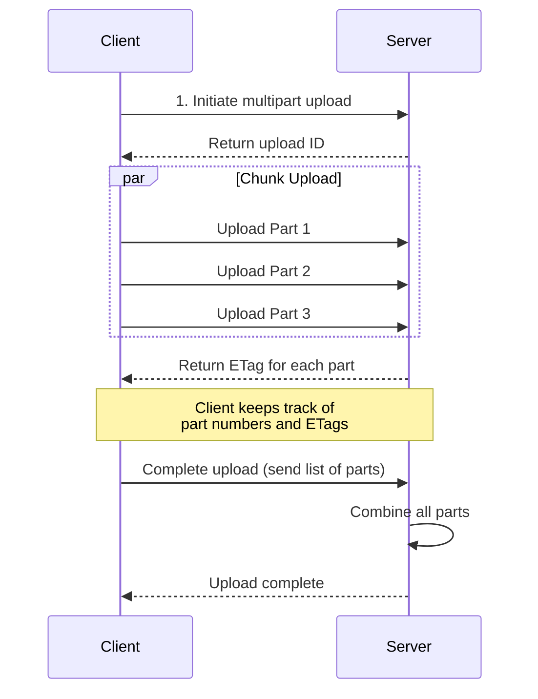
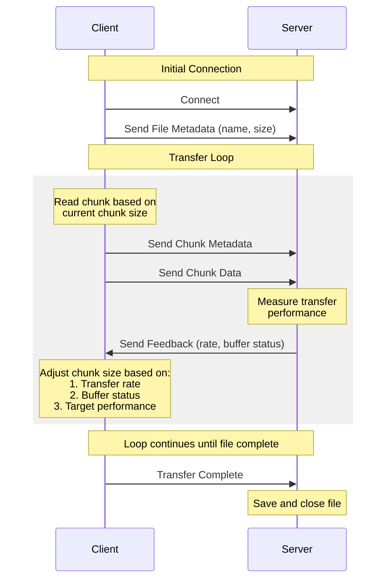

# reelpick

a low latency system to let you do all kind of stuff with videos

# Installation

## Step 1

download the zip file from the official download page (remember to download version 0.13.0. Master is unstable right now)
[https://ziglang.org/download/]

## Step 2

Extract the zig file

## Step 3

Rename the folder containing zig to **_zig_**

```
mv ./zig-linux-x86_64-0.12.0-dev.1632+acf9de376 ./zig
```

## Step 4

move the zig folder to /usr/local

```
sudo mv zig /usr/local/
```

## Step 5

Add the $PATH to bashrc

- go to the ~/.bashrc file

```
>> sudo nano ~/.bashrc
```

- add the path to zig at the end of the file

```
export PATH=$PATH:/usr/local/zig
```

- source the ~/.bashrc

```
>> source ~/.bashrc
```

- test the installation

```
>> zig
info: Usage: zig [command] [options]

Commands:

  build            Build project from build.zig
  fetch            Copy a package into global cache and print its hash
  init-exe         Initialize a `zig build` application in the cwd
  init-lib         Initialize a `zig build` library in the cwd

  ast-check        Look for simple compile errors in any set of files
  build-exe        Create executable from source or object files
  build-lib        Create library from source or object files
  build-obj        Create object from source or object files
  fmt              Reformat Zig source into canonical form
  run              Create executable and run immediately
  test             Create and run a test build
  translate-c      Convert C code to Zig code

  ar               Use Zig as a drop-in archiver
  cc               Use Zig as a drop-in C compiler
  c++              Use Zig as a drop-in C++ compiler
  dlltool          Use Zig as a drop-in dlltool.exe
  lib              Use Zig as a drop-in lib.exe
  ranlib           Use Zig as a drop-in ranlib
  objcopy          Use Zig as a drop-in objcopy
  rc               Use Zig as a drop-in rc.exe

  env              Print lib path, std path, cache directory, and version
  help             Print this help and exit
  libc             Display native libc paths file or validate one
  targets          List available compilation targets
  version          Print version number and exit
  zen              Print Zen of Zig and exit

General Options:

  -h, --help       Print command-specific usage

error: expected command argument
```

## Install dependencies

```
sudo apt-get update && sudo apt-get install libhiredis-dev

```

## Unit testing

go to each subdirectory of the **/deployment** folder and run

```
$ docker compose up
```

then
go to the /backend dir and run the following commands

```
$ zig test src/file_server/service/opensearch/opensearch_helper.zig -lc -lcurl

$ zig test src/file_server/service/ffmpeg/ffmpeg_helper.zig

$ zig test src/file_server/service/redis/redis_helper.zig -I/usr/include -L/usr/lib -lhiredis

$ zig test src/file_server/service/sqlite/sqlite_helper.zig -I./third_party/sqlite -lc third_party/sqlite/sqlite3.c -DSQLITE_THREADSAFE=1 -DSQLITE_ENABLE_JSON1 -DSQLITE_ENABLE_RTREE -DSQLITE_ENABLE_FTS5 -DSQLITE_ENABLE_COLUMN_METADATA -DSQLITE_ENABLE_UNLOCK_NOTIFY -DSQLITE_ENABLE_DBSTAT_VTAB -DSQLITE_SECURE_DELETE

```

## E2E testing

go to each subdirectory of the **/deployment** folder and run

```
$ docker compose up
```

then go to the **/backend** folder and run

```
zig build test
```

## Build

First run the docker services. Go to each directory of the **/deployment** and run

```
$ docker compose up
```

go to the /backend and run

```
$ zig build
$ mkdir agents
$ cp ./zig-out/bin/reelpick ./agents/reelpick1
$ cd ./agents
$ ./reelpick1
```

**NOTE:** The envoy proxy can handle upto two backend server (port 5000 and 5050). So if you wanna see parallel chunk processing, then change the port in the backend/main.zig from 5050 to 5000 (or vice versa) and repeat the above steps (change `cp ./zig-out/bin/reelpick ./agents/reelpick1` to `cp ./zig-out/bin/reelpick ./agents/reelpick2`) and run `./reelpick2`

go to the /frontend folder (front end only support file upload for now, for join and trim, see the curl request below)

```
$ npm  run start
```

**Docker**: the backend is pushed on docker hub (docker pull bihari123/reelpick5050:latest)

## API for trimming and joining

```
# Video Trim Request
curl -X POST http://localhost:5000/api/video/trim \
  -H "Content-Type: application/json" \
  -H "Authorization: Bearer tk_1234567890abcdef" \
  -d '{
    "fileName": "./uploads/sample2.mp4",
    "start_time": 30,
    "duration": 60,
    "outputFile": "output.mp4"
  }'

# Video Join Request
curl -X POST http://localhost:5000/api/video/join \
  -H "Content-Type: application/json" \
  -H "Authorization: Bearer tk_1234567890abcdef" \
  -d '{
    "parts": ["../samples/sample1.mp4", "../sample/sample2.mp4"],
    "outputFile": "joined_output.mp4"
  }'
```

## Time bound link sharing

There are two ways of doing that depending upon how seriouly we take security. For a simple and quick implementation, we can use JWT. But JWT can be decoded using online tools, so we don't wanna use them. In some modern books, they even suggest PASETO but keeping our implementation in mind I think that It would be better to use session tokens with redis, which we are already using for the job tracking across multiple containers here. This way the session data is stored securely at the server and cannot be decoded from the token alone. In this approach, the client sees this

```
eyJhbGciOiJIUzI1NiIs-4Wy8fHw8fDw_example_token
```

which is just the key to the following data stored in the redis

```
# Example of what's in Redis (only accessible server-side)
{
    "session:eyJhbGciOiJIUzI1NiIs-4Wy8fHw8fDw_example_token": {
        "user_data": {
            "user_id": "12345",
            "username": "john_doe",
            "role": "admin"
        },
        "created_at": "2024-11-12T10:00:00",
        "last_accessed": "2024-11-12T10:30:00",
        "expiry": 86400
    }
}
```

I like this approach because this way we don't have a decodable data exposed and we have complete control over the token lifecycle, there is no risk of token manipulation and it has no meaning outside redis data. It will also be easier to put a limit on the number of times a token link has been accessed

## Video demo

https://github.com/user-attachments/assets/70e241b7-c2cd-44e7-bc36-8216a5af1784

## Extras

- link to download the old football videos: https://footballia.net/
- extend your c/c++ project with zig :https://zig.news/kristoff/extend-a-c-c-project-with-zig-55di
- install ffmpeg `sudo apt update sudo apt install ffmpeg `
- Envoy proxy : https://github.com/helpfulBadger/envoy_getting_started/tree/master/01_front_proxy

### Parallel uploading

Key improvements in this implementation:

1. **True Parallel Processing**:
   - Multiple chunks of the same file are uploaded simultaneously
   - Each chunk can be processed by a different backend server
   - Chunk integrity is verified using hashes
2. **Distributed State Management**:
   - Uses Redis to store upload session data
   - All servers can access the same session information
   - Progress tracking is synchronized across servers
3. **Chunk Management**:
   - Each chunk has its own metadata including hash and size
   - Chunks are stored individually and reassembled after verification
   - Failed chunks can be retried without affecting others
4. **Data Integrity**:

   - Chunks are verified using SHA-256 hashes
   - Final file verification ensures all chunks were received correctly

   ## Chunk based upload using multipart protocol

   ![[chunk-based-upload-using-mulipart-protocol.png]]Let me explain how chunk-based multipart uploads work at a high level.



Here's how multipart uploads work:

1. Initialization

   - Client initiates the multipart upload
   - Server returns a unique upload ID

2. Splitting and Uploading

   - Large file is split into smaller chunks locally
   - Each chunk becomes a "part" with a number (1, 2, 3, etc.)
   - Parts can be uploaded in parallel
   - Each successful part upload returns an ETag (identifier)

3. Tracking

   - Client maintains a list of uploaded parts
   - Each part is identified by its part number and ETag
   - Failed parts can be retried individually

4. Completion
   - After all parts are uploaded, client sends a completion request
   - Request includes the list of all parts in order
   - Server validates and combines all parts into the final file

Key benefits:

- Resume-able uploads
- Parallel uploads for better performance
- Better handling of large files
- Improved reliability with retry capability
- Network efficiency

### Adaptive Chink size file transfer sequence

We could also have used the adaptive chunk size file transfer.
I'll create a sequence diagram showing the high-level flow of the adaptive chunk sizing system for file transfers.



Let me break down the key components:

1. **Initial Setup**

   - Client connects to server
   - Sends file metadata (name, total size)

2. **Transfer Loop**
   Each iteration involves:

   - Client reads a chunk based on current chunk size
   - Sends chunk metadata + data
   - Server measures performance
   - Server sends feedback
   - Client adjusts chunk size for next iteration

3. **Adaptive Logic**
   Chunk size adjusts based on:

   - Transfer rate vs target rate
   - Server buffer status
   - Network conditions

4. **Completion**
   - Transfer continues until file is complete
   - Server saves and closes file

The adaptive nature comes from the continuous feedback loop during transfer, allowing the system to optimize chunk sizes in real-time based on current conditions.
